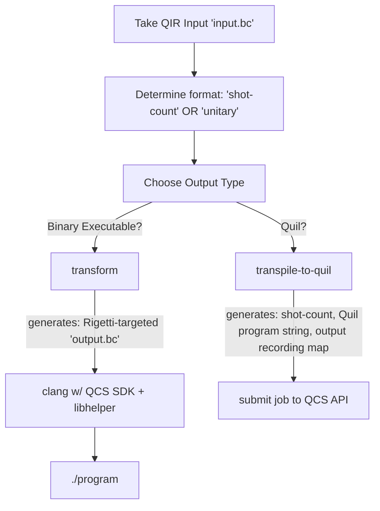

# QCS QIR SDK

Compile & run Quantum Intermediate Representation (QIR) programs on Rigetti QCS.

## Usage 

The easiest way to start is by downloading the [latest release](https://github.com/rigetti/qcs-sdk-qir/releases/latest).

Within the release, you will find a `README.md` pertaining to the specific version you've downloaded,
based on [this template](./scripts/release/README.release.md). Those instructions cover the basics
to compile an executable that can run quantum programs on Rigetti QPUs or the QVM.

## Overview



## Development

In order to build this crate, a supported LLVM version must be installed and available on your `PATH` 
(you must be able to run `llvm-config`). The supported versions are listed in `Cargo.toml` under 
`[features]`.

To build the CLI: 
```sh
cargo build --bin qcs-sdk-qir --features llvm13-0
```

To run the unit and snapshot tests: 
```sh
cargo test --features llvm13-0
```

To test your changes alongside the shared libraries, it might be helpful to reuse the release 
scripts and test a fully integrated toolset. To do so, it's recommended to use `cargo-make`. Install
it by running:
```sh
cargo install cargo-make
```

Use the following task and configurations to build the SDK with your changes:
```sh
cargo make release-quick # skips the Rust unit and snapshot tests & and other checks
```

After this, you can skip building various components if a new build is not necessary: 
```sh
# any or all of the following env vars can be used:
NO_C_SDK_BUILD=1 NO_QIR_SDK_BUILD=1 NO_HELPER_LIB_BUILD=1 cargo make release-quick

# NO_C_SDK_BUILD: skips the git clone & build of the `qcs-sdk-c` library (default: 0)
# NO_QIR_SDK_BUILD: skips the build of this repo (default: 0)
# NO_HELPER_LIB_BUILD: skips the build of the helper lib (default: 0)
```

To reset your environment and clean up release build artifacts, run:
```sh
cargo make release-clean
```

## Testing

Refer to the included `README.md` in your own local release build, which will help you test your
changes if you are looking to transform and compile QIR programs. 

For a full end-to-end integration test against both `qvm` and QPUs, you can use:

```sh
cargo make release-test-e2e <TARGET> <PROGRAM>
# TARGET = one of: qvm, Aspen-11
# PROGRAM = path to an LLVM bitcode (.bc) file to transform and compile into executable format
```

```sh
cargo make release-test-e2e
# defaults to:
# cargo make release-test-e2e qvm tests/fixtures/programs/reduction.bc
# use any of {qvm,Aspen-11}, assuming you can access the QPUs.

# using the default test program
cargo make release-test-e2e Aspen-11

# using a different test program (note: target must be provided, args are positional)
cargo make release-test-e2e Aspen-11 ./input.bc 
```

## Examples

Given an input QIR program that might look like this:

```llvm
%Qubit = type opaque
%Result = type opaque

declare void @__quantum__qis__h__body(%Qubit*) local_unnamed_addr
declare void @__quantum__qis__mz__body(%Qubit*, %Result*) local_unnamed_addr
declare i1 @__quantum__qis__read_result__body(%Result*) local_unnamed_addr

; simple function which measures a single qubit and that's it.
define internal fastcc void @QuantumApplication__Run__body() unnamed_addr {

entry:
    br label %body

body:
    ; shot count variable
    %0 = phi i64 [ %2, %body ], [ 1, %entry ]

    ; measure a given qubit index
    tail call void @__quantum__qis__mz__body(%Qubit* nonnull inttoptr (i64 1 to %Qubit*), %Result* null)
    %1 = tail call i1 @__quantum__qis__read_result__body(%Result* null)

    ; shot count branch
    %2 = add nuw nsw i64 %0, 1
    %3 = icmp ult i64 %0, 42
    br i1 %3, label %body, label %exit

exit:
    ret void
}
```

This library will:

- Read and parse the LLVM bitcode
- Recurse through all functions called from the entrypoint. Within each function body:
  - Identify a shot-count loop with quantum instructions within any basic blocks traversed
  - Transform those basic blocks to instead send an equivalent Quil program for execution using the [QCS C SDK](https://github.com/rigetti/qcs-sdk-c).
- Output the resulting LLVM IR, which - if the input program matched the assumptions made by this library - no longer contains calls to QIR intrinsics and thus may be compiled for any supported architecture using QIR-unaware compilers such as `gcc` and `clang`.

After this process is complete, the above snippet might look like this (once disassembled):

```llvm
; ModuleID = 'program.bc'
source_filename = "./test/fixtures/programs/measure.ll"

%Qubit = type opaque
%Result = type opaque
%Executable = type opaque
%ExecutionResult = type opaque

@parameter_memory_region_name = private unnamed_addr constant [12 x i8] c"__qir_param\00", align 1
@quantum_processor_id = private unnamed_addr constant [9 x i8] c"Aspen-10\00", align 1
@quil_program = private unnamed_addr constant [35 x i8] c"DECLARE ro BIT[0]\0AMEASURE 1 ro[0]\0A\00", align 1

declare void @__quantum__qis__h__body(%Qubit*) local_unnamed_addr

declare void @__quantum__qis__mz__body(%Qubit*, %Result*) local_unnamed_addr

declare i1 @__quantum__qis__read_result__body(%Result*) local_unnamed_addr

define internal fastcc void @QuantumApplication__Run__body() unnamed_addr {
entry:
  br label %body_execution

body:                                             ; preds = %body_execution, %body
  %0 = phi i64 [ %2, %body ], [ 1, %body_execution ]
  %1 = call i1 @get_readout_bit(%ExecutionResult* %5, i64 %0, i64 0)
  %2 = add nuw nsw i64 %0, 1
  %3 = icmp ult i64 %0, 42
  br i1 %3, label %body, label %exit

body_execution:                                   ; preds = %entry
  %4 = call %Executable* @executable_from_quil(i8* getelementptr inbounds ([35 x i8], [35 x i8]* @quil_program, i32 0, i32 0))
  call void @wrap_in_shots(%Executable* %4, i32 42)
  %5 = call %ExecutionResult* @execute_on_qpu(%Executable* %4, i8* getelementptr inbounds ([9 x i8], [9 x i8]* @quantum_processor_id, i32 0, i32 0))
  call void @panic_on_failure(%ExecutionResult* %5)
  br label %body

exit:                                             ; preds = %body
  ret void
}

declare %Executable* @executable_from_quil(i8*)

declare %ExecutionResult* @execute_on_qpu(%Executable*, i8*)

declare i1 @get_readout_bit(%ExecutionResult*, i64, i64)

declare void @panic_on_failure(%ExecutionResult*)

declare void @set_param(%Executable*, i8*, i32, double)

declare void @wrap_in_shots(%Executable*, i32)

define i32 @main() {
entry:
  call void @QuantumApplication__Run__body()
  ret i32 0
}
```

---

_Read the following for a more detailed run-down on usage / development:_

## Extra Dependencies for [Full QIR Conversion](#transform-qir)

> These are not required if only [transforming unitary QIR to Quil](#transpile-qir-to-quil).

* A C compiler, such as `gcc` or `clang`, which supports LLVM 11 at a minimum. For OSX users, this 
means XCode version >= 12.5.
* The QCS SDK shared library, which may be built or downloaded as described [here](https://github.com/rigetti/qcs-sdk-c). 

You'll also need to compile the shared "helper" library contained in the `helper` directory. This 
small shared library is used to reduce the complexity required within this crate's LLVM 
transformations.

```sh
cd helper
./build.sh
```

Once that's compiled, make sure to set the relevant environment variables to point to it, within the 
terminal where you'll be transpiling and running your QIR programs:

```sh
# Linux
export LD_LIBRARY_PATH=$LD_LIBRARY_PATH:/path/to/qcs-sdk-qir/helper

# OSX
export DYLD_LIBRARY_PATH=$DYLD_LIBRARY_PATH:/path/to/qcs-sdk-qir/helper

# Windows? (To be verified)
export PATH=$PATH:/path/to/qcs-sdk-qir/helper
```

## Transform QIR

To transpile an input QIR program, run the CLI. Note that you **must specify your LLVM version 
corresponding with your installed version or this will fail with dozens of errors**:

```
cargo run --features llvm13-0 transform path/to/input.bc path/to/output.bc --add-main-entrypoint
```

Use the `--help` flag to view all options, such as whether to target the QVM or a QPU:

```
cargo run --features llvm13-0 transform --help
```

### QIR Preconditions

QIR may only be transpiled in this way if:

- An entrypoint function exists (TBD)
- Every function within the call tree from the entrypoint:
  - Contains at least one basic block
- All basic blocks within transpiled functions which contain at least one QIR intrinsic must satisfy the *basic block preconditions*:
  - Begin with a `phi` instruction; the operand specifying the current block must reference a variable which we will call the _shot count variable_; the other operand must reference a constant value of 1. This initializes the shot count variable.
  - At least one QIR intrinsic, and any number of classical instructions. The return value of any of these classical instructions may not be used as an operand to any QIR intrinsic invocation.
  - A shot count termination sequence as the final three instructions of the block:
    1. An increment: `add` of constant `1` to the _shot count variable_.
    2. A comparison between the _shot count variable_ and a constant, which we will refer to as the _shot count_.
    3. A conditional branch instruction, which targets the basic block if the comparison fails and a different block if it succeeds.
- Basic blocks which do not match the pattern described here are passed through unchanged. If that leaves QIR intrinsics unaltered, then further compilation by a classical toolchain (ie `gcc`) will likely fail.

## Run Your Transformed QIR

Now that you've got an output `.bc` file, you can inspect it by disassembling it (optional): `llvm-dis output.bc`, assuming that's what you named your output file in the CLI command above.

Next, compile it by linking to the two shared libraries in use: the helper library (here in this repo) and the QCS SDK (installed as part of [Setup](#setup)). Here's an example using `gcc`:

```sh
gcc -Lpath/to/qcs-sdk-c-shared-lib  -lqcs -L./helper -lhelper output.bc -o program
```

That produces an executable `program` which you can then run to execute your program on QCS. Happy computing!

## Transpile QIR to Quil

To transpile an input QIR program to Quil, run the CLI as shown here, following the LLVM-related instructions above. Note that this command only works for "simple" QIR modules which satisfy the following:

- All quantum instructions are contained within a single basic block, labeled `body`, within the entrypoint function.
- That function itself makes no function calls within the `body` block.
- The `body` basic block satisfies the _basic block preconditions_ described above in [QIR Preconditions](#qir-preconditions).

```
cargo run --features llvm13-0 transpile-to-quil path/to/input.bc
```

This will write the Quil program and shot count to `stdout`.

## Troubleshooting

### Logging

Run the CLI with `RUST_LOG` set in order to view logs emitted during the transformation process. Values include the verbose `debug` as well as `info`, `warning`, and `error`.

### Rust compilation error: "No suitable version of LLVM..."

Example:

```
   Compiling llvm-sys v110.0.2
error: No suitable version of LLVM was found system-wide or pointed
       to by LLVM_SYS_110_PREFIX.

       Consider using `llvmenv` to compile an appropriate copy of LLVM, and
       refer to the llvm-sys documentation for more information.

       llvm-sys: https://crates.io/crates/llvm-sys
       llvmenv: https://crates.io/crates/llvmenv
   --> .../.cargo/registry/src/github.com-1ecc6299db9ec823/llvm-sys-110.0.2/src/lib.rs:486:1
    |
486 | / std::compile_error!(concat!(
487 | |     "No suitable version of LLVM was found system-wide or pointed
488 | |        to by LLVM_SYS_",
489 | |     env!("CARGO_PKG_VERSION_MAJOR"),
...   |
496 | |        llvmenv: https://crates.io/crates/llvmenv"
497 | | ));
    | |___^

```

First, make sure you do in fact have the same LLVM version installed and on your `PATH` as you've 
specified with the `--features` option in `cargo`. Run `llvm-config --version` to confirm. If not, 
that needs fixing first.

If you do, perhaps you first tried to build the crate before LLVM was installed and configured. Run 
`cargo clean -p llvm-sys` to clear the build and then retry.

You may also want to try setting the `LLVM_SYS_<version>_PREFIX` environment variable to point to 
the LLVM installation you want to use. For example, if you've installed LLVM 13 via Homebrew on 
macOS, try `export LLVM_SYS_130_PREFIX=/usr/local/opt/llvm`.

### gcc compilation error: ld: library not found for -lhelper

```
$ gcc -L../qcs-sdk-c  -lqcs -L./helper -lhelper program.bc -o program
ld: library not found for -lhelper
```

Did you build the helper library in `./helper`? See [Setup](#setup).

### Runtime error: Library not loaded, image not found

On OSX, it might look like this:

```
$ ./program
dyld: Library not loaded: libhelper.dylib
  Referenced from: .../qcs-qir-sdk/./program
  Reason: image not found
```

The fix: set your `LD_LIBRARY_PATH` / `DYLD_LIBRARY_PATH` / `PATH` to include the relevant directory as described above in [Setup](#setup).

### Runtime error: program hangs for 30 seconds on start

Make sure you're running the dependencies specified by the QCS SDK, namely `quilc`.
